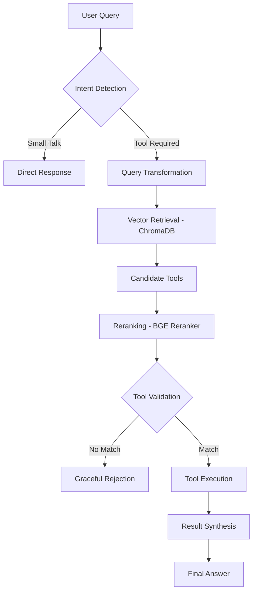

# 🤖 UtaiSOFT Case Study - Dynamic Tool Selection & Agent Architecture

Bu proje, **Hasan Kırtaş** tarafından UtaiSOFT AI Engineer vaka çalışması için geliştirilmiş; ölçeklenebilir ve dinamik tool seçimi yapan bir **Agentic AI** prototipidir.

## I. Overview & Problem Statement
Geleneksel ajan mimarilerinde tüm araç tanımlarının sistem prompt'una sığdırılması, sistem ölçeklendikçe yüksek token maliyeti ve modelin araçları birbirine karıştırması gibi sorunlara yol açar. Bu projede, ajanın araçları önceden bilmediği ve sadece ihtiyaç anında en doğru aracı keşfedip kullandığı bir yapı tasarladım.

## II. Architecture & Workflow
Sistemi, merkezi bir depo katmanından beslenen ve sadece ilgili yeteneği o anlık çağıran bir **Orkestratör** olarak kurguladım.



## III. Agent Design

### Intelligence Layer (Model & API Choice)
*   **Model:** **DeepSeek-V3.2-fast** modelini güçlü reasoning yeteneği ve hızı nedeniyle seçtim. 
*   **API:** **Nebius (Token Factory)** altyapısını tercih ettim. Avrupa merkezli sunucuları sayesinde sunduğu low-latency başarısı ve maliyet avantajı, son projelerimde de sıklıkla tercih ettiğim optimize bir detaydır.

### Orchestration Logic (Prompt Chaining & CoT)
Süreci modüllere bölerek hata payını minimize ettiğim bir **Prompt Chaining** yapısı kurguladım. Bu yöntem, ajanın adım adım düşünmesini sağlayarak her aşamada doğrulanabilir çıktılar üretmesine olanak tanır.

## IV. Tool Selection Strategy
Sistemin en kritik bileşeni, alakasız araçların tetiklenmesini engelleyen ve yüksek isabet oranını önceliklendiren 3 aşamalı seçim hattıdır:

*   **Step 1: Semantic Retrieval** – Kullanıcı niyetine göre üretilen sorguyla, en yakın 5 aday araç vektör veritabanından hızla çekilir.
*   **Step 2: Reranking** – Sadece kelime benzerliğine güvenmek yerine, `BGE-Reranker` ile adayların dökümantasyonunu kullanıcı sorgusuyla mantıksal olarak kıyaslayıp tekrar sıraladım.
*   **Step 3: Validation** – Final aşamasında LLM, seçilen araçların gerçekten göreve uygun olup olmadığını dökümantasyon üzerinden son kez denetler. Bu adım, ajanın yanlış araç kullanmasını engelleyen bir güvenlik katmanıdır.

**Mühendislik Tercihi:** Bu yaklaşımda, hız yerine isabet oranını önceliklendirdim. Bir ajanın yanlış aracı kullanmasındansa, güvenli bir şekilde durması tasarımda benimsediğim temel prensiptir.

## V. Tool Discovery & Registry
Vektör veritabanı olarak, düşük seviyeli alternatiflerine kıyasla basitliği ve hızlı prototiplemeye uygunluğu nedeniyle **ChromaDB**'yi seçtim. Embedding tarafında, lokalde çalışan SOTA performanslı **BGE-Large** modelini tercih ettim.

Not: Embedding ve reranking modelleri, performans/CPU-RAM dengesine göre yalnızca model adları güncellenerek daha hafif varyantlarla değiştirilebilir.

## VI. Software Quality & Engineering Principles
Sistemi net modüler sınırlarla inşa ettim:
*   Araçlar, arşiv ve ajan mantığı sorumlulukların izole edilmesi için birbirinden ayrılmıştır.
*   `Pydantic` modelleri ile giriş doğrulaması yapılarak çalışma zamanı hataları önlenmiştir.
*   Yeni yetenekler, ana sistemde herhangi bir kod değişikliği yapmadan eklenebilir.

## VII. Sample Scenarios & Execution Logs

Sistemin karar alma sürecini ve farklı durumlardaki davranışını görmek için tüm senaryo çıktıları [`agent_thinking_process.txt`](./agent_thinking_process.txt) dosyasında detaylı olarak yer almaktadır.

Aşağıda iki temsili senaryonun çıktısı verilmiştir:

**Senaryo 1: Başarılı Araç Kullanımı (Hava Durumu)**
```
[INTENT DETECTION] requires_tool: True | search_query: get current weather conditions for a city in celsius
[TOOL RETRIEVAL]   candidates: ['weather_service', 'code_executor', 'database_query', ...]
[TOOL EXECUTION]   Tool 'weather_service' executed successfully.
                   result: {'location': 'Tokyo', 'temperature': 22, 'condition': 'Partly Cloudy'}
[FINAL RESPONSE]   Currently in Tokyo, it's partly cloudy with a temperature of 22°C.
```

**Senaryo 2: Hallucination Guard (Kapsam Dışı İstek)**
```
[INTENT DETECTION] requires_tool: True | search_query: scientific information on quantum teleportation
[TOOL RETRIEVAL]   candidates: ['web_search', 'document_reader', 'calendar_manager', ...]
[TOOL SELECTION]   can_fulfill: False
                   reasoning: All retrieved tools are designed for digital tasks.
                              None can perform or facilitate physical teleportation.
[FINAL RESPONSE]   I'm sorry, but I don't have the capability to teleport you to Mars...
```

> Tüm senaryo çıktıları (7 senaryo) için: [`agent_thinking_process.txt`](./agent_thinking_process.txt)

## VIII. Setup Guide
1. Ön koşullar
   - Python `3.12`
   - `poetry` yüklü
2. Bağımlılıkları yükleyin
   - Proje kök dizininde: `poetry install`
3. API anahtarını ayarlayın
   - Proje kök dizininde `.env` oluşturun
   - Şu değişkeni ekleyin: `NEBIUS_API_KEY=...`
4. Uygulamayı çalıştırın (Streamlit arayüzü)
   - `poetry run streamlit run main.py`
   - Konsolda görünen `Local URL` üzerinden uygulamayı açın.
5. Hızlı doğrulama (opsiyonel demo)
   - `poetry run python run_agent_demo.py`
   - Araç seçim ve tool execution akışı `agent_thinking_process_demo.txt` dosyasına yazılır.
6. Testleri de çalıştırma (opsiyonel)
   - `poetry run pytest -q` (LLM çağrıları için `.env` içinde `NEBIUS_API_KEY` olmalı).

---
*Developed by **Hasan Kırtaş** for UtaiSOFT AI Case Study.*
